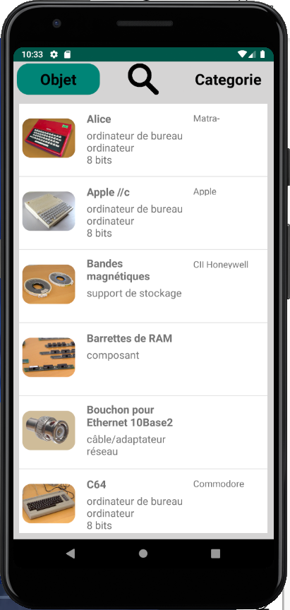
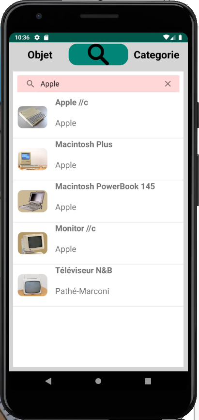
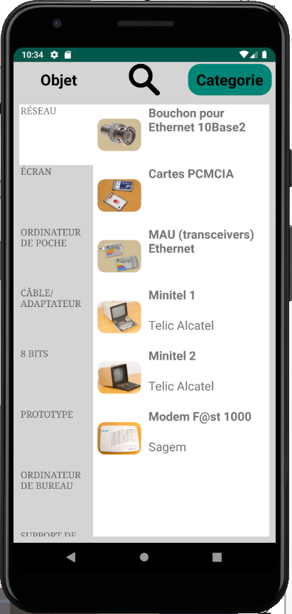
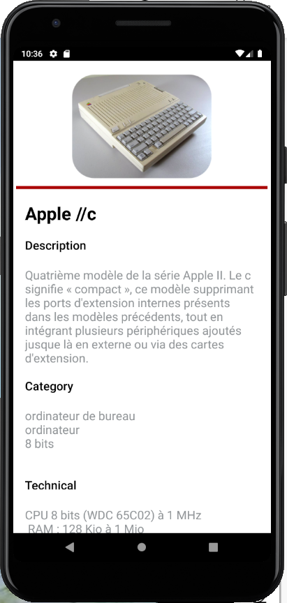

# musée du CERI

## Itroduction 
Le CERI a rassemblé quelques ordinateurs anciens et autres artefacts du passé del’informatique, cette application montre ces ordinateurs anciens pour les étudiants visitenten ligne, il se compose par le nom, la marque, la description, les techniques etc. Affichagetrès détaillé de ces artefacts

## Charger les donées des objets
La première fois que vous utilisez l’APP, il vous sera demandé le droit de stockage. Aprèsavoir obtenu le droit d’utilisation, il obtiendra automatiquement des données via l’API. Çadurée à peu près 7 seconds pour charger les donées asynchronisme.

Je crée un class de ObjetMusee et un class de Category, pour chaque objet qui enregistre les donées en type String (transforme array à un String, séparateur par ";"), c'est plus facile pour l'affichage.  

## Implémentation de l’interface
L'interface est principalement réalisée par Fragment, je construre 3 fragments. Les utilisateurs pouvent glise l'écran à gauche ou à droit afin de changer le fragment.

### Affichage de l’objet

Il présent la liste des objets, pour chaque objet il compose son image en miniature, son nom et sa marque (le cas échéant), ainsi que les catégories auxquelles il appartient. Cette liste est triée par ordre alphabétique. L'utilisateur pourrait visiter la détail de l'objet en cliqant l'item.

### Recherche

Le fragment de recherche présent par un \texttt{SearchView}, l'utilisateur pourrait entrer le mot clé et puis taper \texttt{Entrer} pour chercher l'objet correspondant.

Ensuit la liste de l'objet contient son image en miniature, son nom et sa marque (le cas échéant). La liste est triée par ordre alphabétique. L'utilisateur pourrait visiter la détail de l'objet en cliqant l'item.

### Affichage par catégories

Le fragment de l'affichage par catégories qui contient 2 ListView, un pour afficher le nom de catégories et l'un autre pour afficher les objets qui sont dans la catégories. Charger la liste à droit en cliquant sur l'élément à gauche. La couleur d'arrière-plan par défaut est le gris, il a mis à jour en blanc après sélectionné. Cela améliore le sentiment d'appartenance.

### Détail des objets

Le détail des objets qui contient le nom, la description, ses catégories et timeFrame. D’autres champs ne sont présents que lorsqu’ils ont un sens pour cet objet et une valeur non vide, comme le année, la marque, les technique et les photos.

L'identité de photo et sa description est enregistré dans la base de données en form String, lorsque l'utilisateur clique select item de l'objet, il va séparer la String puis le garder dans la tableau afin de charger le photo asynchronisme.
