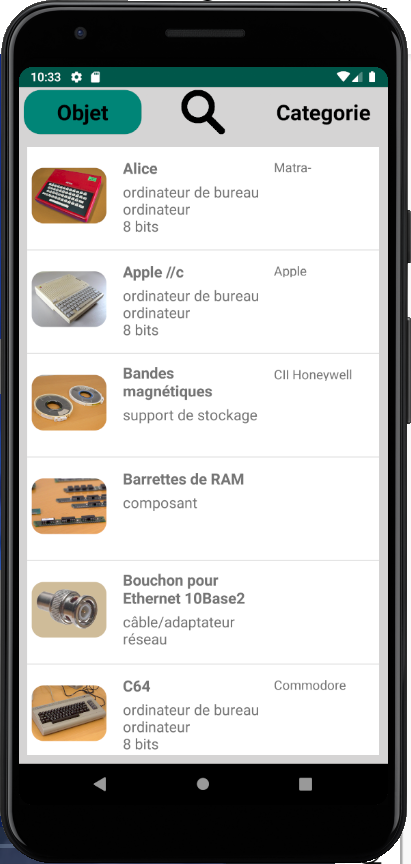
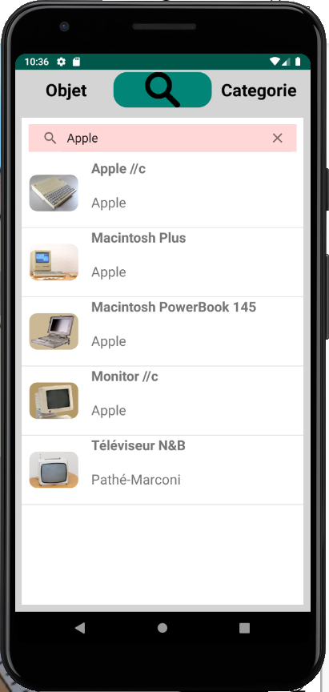
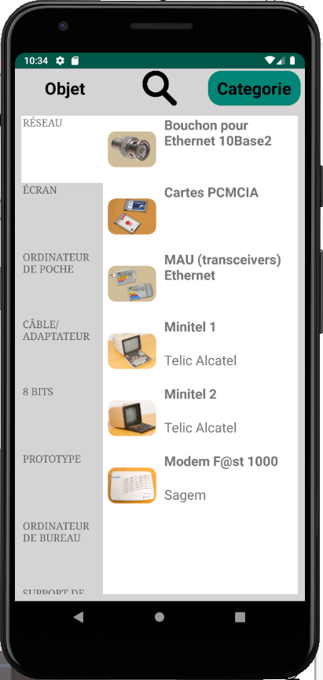
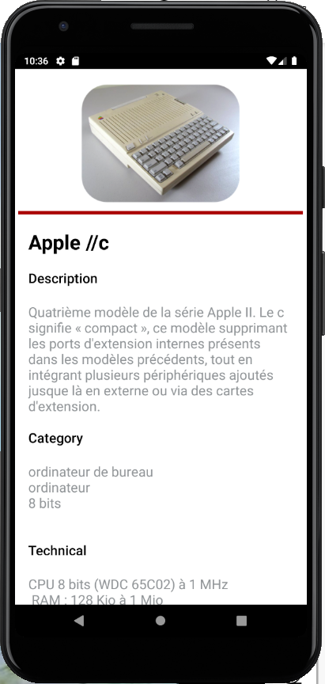

# CeriMuseum

## Introduction

Au fûr du temps le CERI a rassemblé une multitude d'ordinateurs anciens et autres artefacts du passé de l’informatique (Premières éditions du langage Prolog, etc...) dans le but de raconté l'histoire de l'établissement et de la région. Cette application à pour but de rassembler l'ensemble de ces reliques du passé dans le but de les faire découvrir aux nouveaux visiteurs et étudiants.

## Interaction avec l'API REST

Les informations sur la collections sont obtenus en faisant des requêtes asynchrone à l'API REST conçu à cette éffet. Une fois télécharger, les données sont mises en cache sur l'appareil afin de permettre un usage hors-ligne de l'application.

## L'interface graphique

L'interface graphique a était réaliser en utilisant Android et ce voit segmenté en un ensemble de Fragments indépendants les uns des autres.

Les objets sont présenté sous la forme de cartes ayant: une image en miniature, les catégories auxquelles il appartient, le nom et la marque du produit. L'utilisateur à la possibilité d'obtenir une description détailler d'un produit en cliquant sur la carte. 

Cette liste peut être triée par ordre alphabétique, être parcourut à l'aide d'une bar de recherche et affiner avec d'autres critaires comme l'année de commercialisation, les catégories d'appartenance, etc ... .

